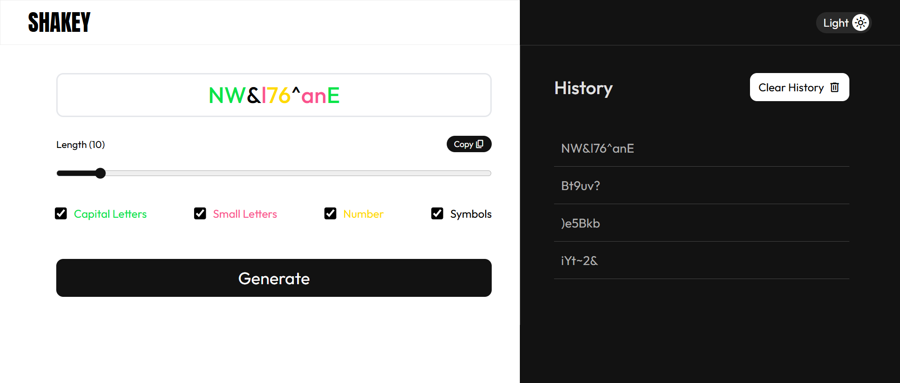

# Shakey Password Generator

Shakey Password Generator is a web-based tool for creating secure, customizable passwords. Built with HTML, CSS, and JavaScript, it features light/dark themes, password history, and a responsive UI with GSAP animations.

## Screenshot

## Demo

## Features

- Generate passwords (6-50 characters) with capital letters, small letters, numbers, and symbols.
- Toggle light/dark themes with localStorage persistence.
- Store up to 5 passwords in history with copy/delete options.
- Copy passwords to clipboard with animations.
- Responsive design for all devices.
- Color-coded password display.

## Copyright

© 2025 Khem Raj Budhathoki. All rights reserved.
